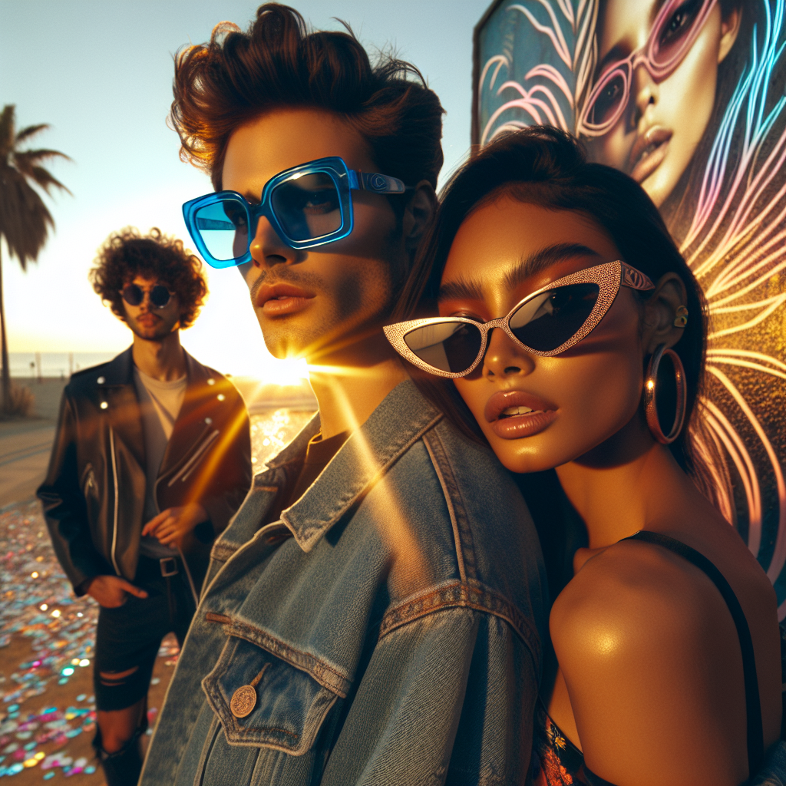

# 🕶️ Summer Sunglasses Campaign – Executive Summary

## 📊 Refined Trend Insights
Executive Summary  
As we gear up for Summer 2025, the sunglasses landscape is defined by three dominant style movements—each offering a unique opportunity to reinforce our brand’s leadership in fashion, performance, and social media visibility. By spotlighting two bold, on-trend silhouettes alongside our perennial best-seller, we can drive engagement, broaden our demographic reach, and ensure a strong return on marketing investment.

Trend Highlights  
• Oversized & Statement Frames  
  – Embrace bold, chunky profiles in both vibrant and timeless colorways—designed to capture attention in street-style editorials and festival photography.  
• Retro-Inspired Shapes  
  – Reinvent classic cat-eyes, wayfarers and aviators with matte acetates and colored lenses, tapping into ’70s–’90s nostalgia among fashion-forward consumers.  
• Minimalist/Rimless & Transparent Designs  
  – Offer lightweight, barely-there options in clear or softly tinted materials for an understated, modern aesthetic.

Product Alignment  
• SG002 Wayfarer  
  – Thick acetate, sharp angles—bridges the oversized statement and retro revival trends. Ideal for high-impact social content.  
• SG003 Mystique (Cat-Eye)  
  – Elegant, upward-swept silhouette with refined temple detailing and a glossy finish that photographs strikingly in summer light.  
• SG001 Aviator  
  – Slim metal frame with large teardrop lenses—our reliable, mass-appeal bestseller providing maximum sun protection and broad demographic coverage.

Campaign Strategy & Justification  
• Visual Magnetism: SG002’s statement shape delivers unparalleled editorial and social-media presence, fueling both organic and paid reach.  
• Nostalgic Glamour: SG003 taps into the resurging demand for vintage silhouettes, resonating strongly with influencers and micro-trend communities.  
• Steady Performer: SG001 Aviator ensures baseline sales and minimizes category risk, anchoring the collection with a universally flattering style.

Recommendation  
Position SG002 (Wayfarer) and SG003 (Mystique) as the campaign’s “hero” pieces in all primary imagery—leveraging their trend alignment and photographic strength—while incorporating SG001 (Aviator) in lifestyle and functional-wear narratives to guarantee broad appeal and consistent performance. This focused approach maximizes our visual impact, capitalizes on emerging consumer preferences, and safeguards overall campaign ROI.

## 🎯 Campaign Visual

    

## ✍️ Campaign Quote
Bold Frames, Timeless Glamour Under the Sun

## ✅ Why This Works
This phrase captures the sunset-lit image’s oversized statement frames and retro-inspired cat-eyes, aligning with the Trend Analysis recommendation to feature the Wayfarer and Mystique as hero pieces for standout summer style.

---

*Report generated on 2025-10-10*
