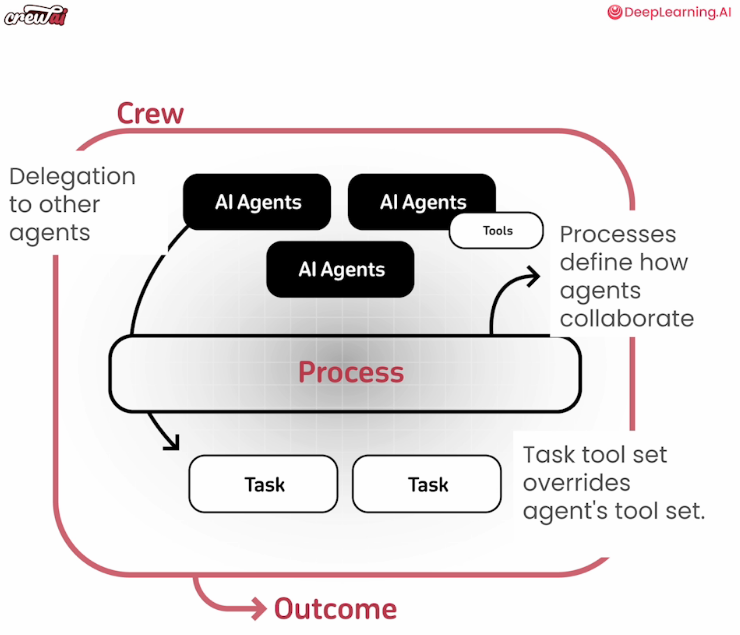

# Overview
This directory shows my notebook examples on how to build Multi-Agent systems using CrewAI from https://learn.deeplearning.ai/courses/multi-ai-agent-systems-with-crewai/

# What is CrewAI
- Framework to build multi-agent systems.
- Also platform to transfer to production.

# High level
- Define Agents. Provide tools if needed.
- Define a Task & what agents. Provide task level tools if needed. 
- Define multiple such Tasks if needed.
- Define a Crew of Agents and Tasks.
- Kick-off the Crew
- Note on exception handling: CrewAI framework is designed to continue execution.

# Key elements / building blocks
1. Agents
    - Do better job when they have following:
    - Role playing
        - Provide Role, Goal, Backstory.
        - Tell the agent that it is a Specialist.
    - Focus
        - Specifically defined task, roles/objectives. 
    - Tools
        - Assigned limited specific tools.
        - Agent level / Task level.
    - Cooperation / Collaboration
        - Take feedback. Delegate tasks.
    - Guardrails
        - Prevent agents from going into loops (repetitive/not productive) / hallucinations.
    - Memory
        - Allows Agent to remember what was done in the past. Agents can self improve using memory.
        - Short-term
            - During execution of task. Even before completion of task.
            - Shared with other agents in task.
        - Long-term
            - Stored after execution of task. CAn be used in future tasks.
            - Leads to "self-improving" agents.
        - Entity
            - Persons, Organizations, Locations
2. Tasks
    - Provide Description, Expectation
    - Can also 
        - Set Context (dependency), Callback.
        - Override agent tools with task specific tools.
        - Run asynchronously.
        - Force human input before ending task.
        - Output as Pydantic, JSON, file, etc.
3. Tools
    - Like search, scrape, etc. Also supports LangChain tools.
    - Better if has following traits.
    - Versatile: 
        - Allow fuzzy inputs & structured outputs
    - Fault-tolerant: 
        - Fail gracefully (dont stop execution) & retry (using the error message)
    - Allows Caching: 
        - Prevents unnecessary requests (API calls, etc.) - For Costs / Rate limits / Runtime
        - Cross-agent caching (Call with same parameters - use cached results)
4. Multi-Agent Collaboration
    - Processes define how Agents collaborate
        - Sequential (From one agent to another)
        - Hierarchical (Talk to each other through a manager)
        - Asynchoronus (Run in parallel)
    - Collaboration
        - Can delegate work to other Agents (independent of process strategy)

# High-level Image

# References:
1. https://learn.deeplearning.ai/courses/multi-ai-agent-systems-with-crewai/
