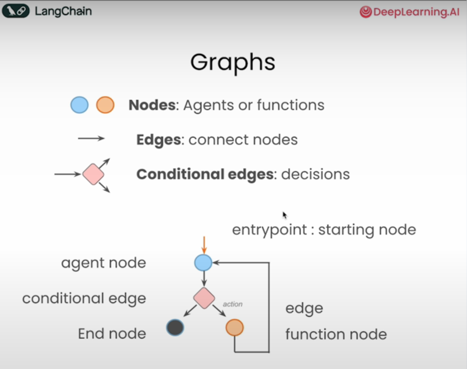
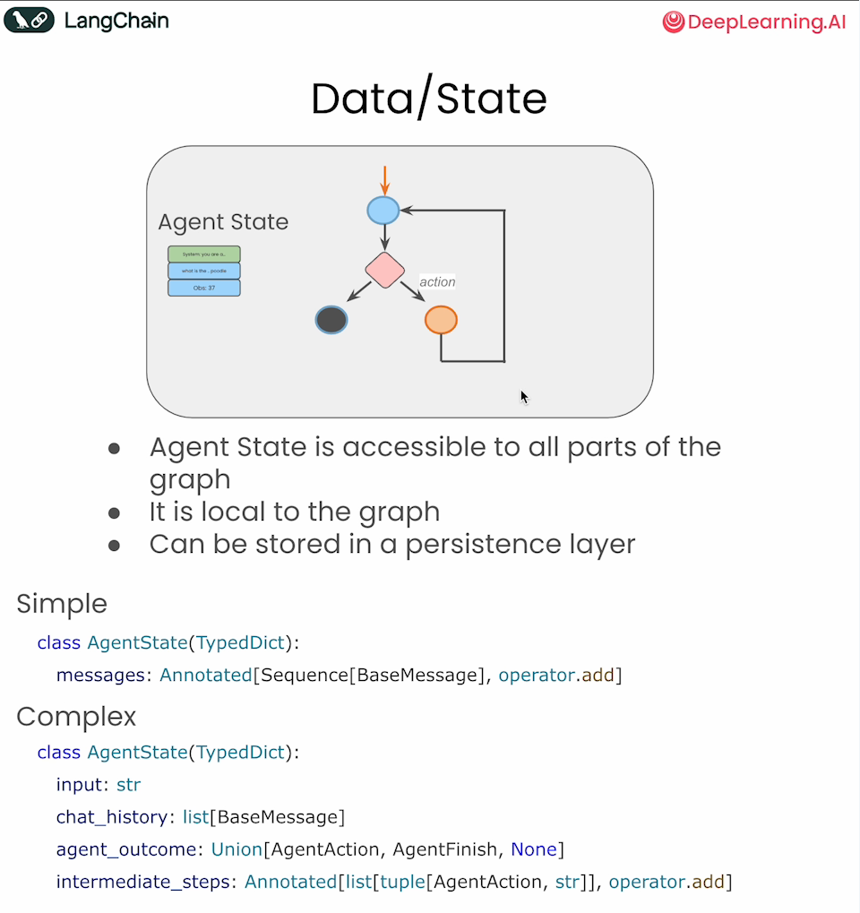
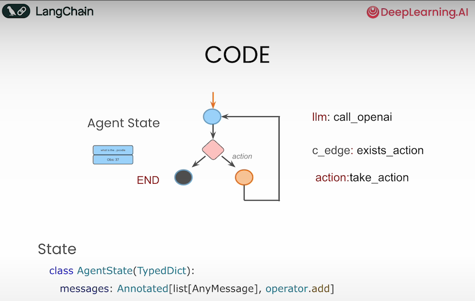
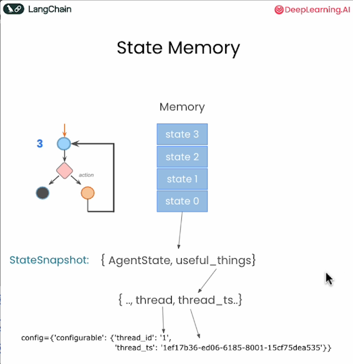
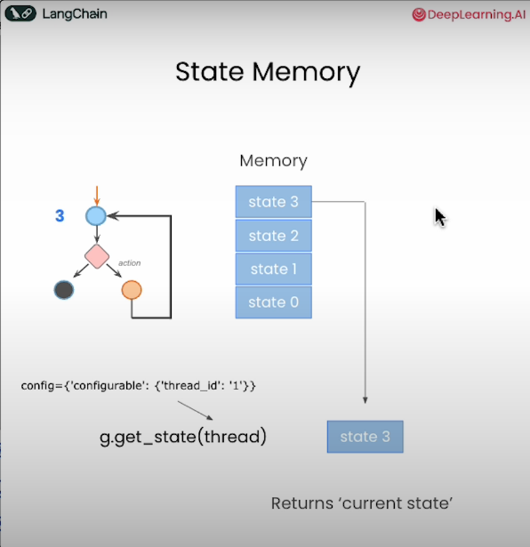
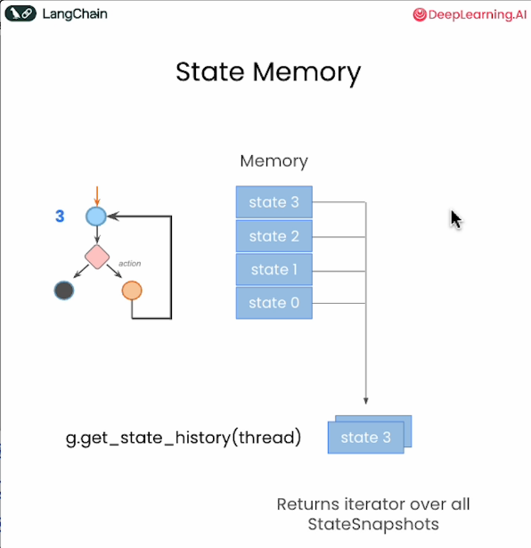
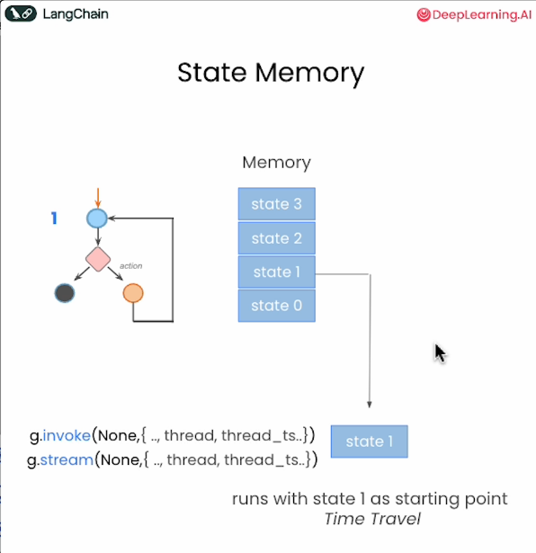
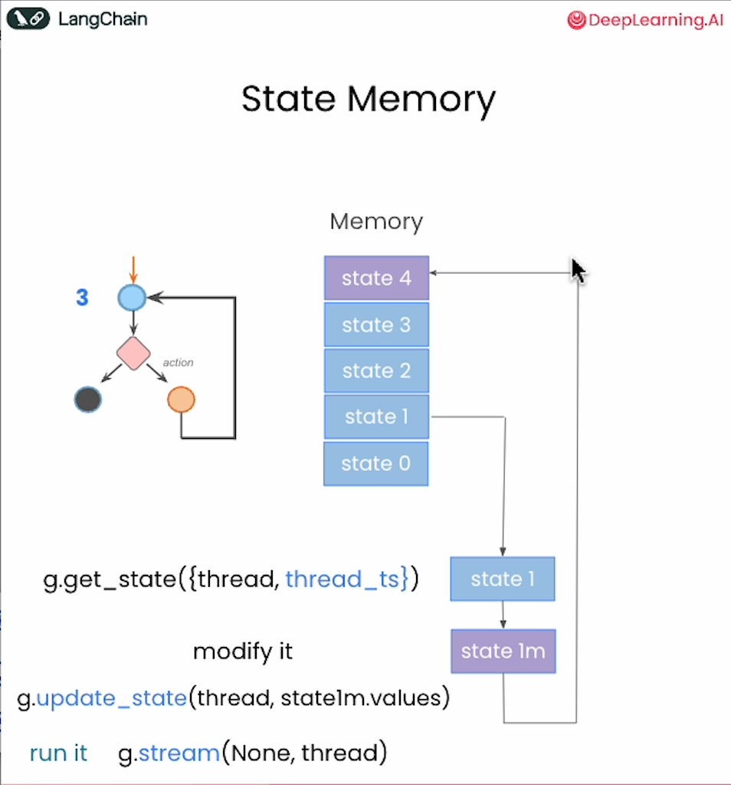

## Overview
- This directory covers LangGraph (concepts, applications) & how to use it to build agentic workflows. 
- It includes my notebooks based on [1,2,3] from Huggingface, LangGraph, Deeplearning.ai:
     - Concepts: `Concept*.ipynb`
     - Appplications: `App*.ipynb`

## When/Why LangGraph?
- Design a flow of actions based on the output of each action, and decide what to execute next accordingly
    - Some example scenarios are workflows/systems/applications that need:
        - Multi-step reasoning
        - Explicit control on the flow
        - Persistence of state between steps
        - Combining deterministic logic with AI capabilities
        - Human-in-the-loop interventions
        - Complex agent architectures with multiple components working together
- LangGraph supports following features on top of vanilla python based agent:
    - States, visualization, logging (traces)
    - Persistence of state between steps
    - Streaming messages/tokens
    - Human-in-the-loop interaction between steps

## How does LangGraph work?
- LangGraph uses a directed graph structure to define the flow of your application
    -    
- Building blocks  
    - Nodes: 
        - Represent individual processing steps
        - Can be python functions or agents. Each node:
            - Takes the state as input, Performs some operation, Returns updates to the state
            - Can contain:
                - LLM calls: Generate text or make decisions
                - Tool calls: Interact with external systems
                - Conditional logic: Determine next steps
                - Human intervention: Get input from users
        - Special nodes: START (entrypoint), END (end of task)
    - Edges: 
        - Connect nodes and define the possible paths through your graph
    - Conditional edges
        - Decisions
    - State: 
        - Is user defined and maintained and passed between nodes during execution
        - When deciding which node to target next, this is the current state that we look at
        -    
        -   
    - StateGraph: 
        - Is the container that holds your entire agent workflow  
        - Add nodes & edges to it 
        - Compile it 
        - Invoke it 
    - State memory
        - Can be used to get the state, update the state, mimic tool calls, replay the workflow with a modified state, etc.
        - Can be used for human in loop interactions, updates, etc.
        -   
        -   
        -   
        -   
        -   
- Some Workflows
    - ReAct pattern  
    - Reflection pattern

### References:
1. https://huggingface.co/learn/agents-course/unit1/what-are-agents
2. https://huggingface.co/docs/smolagents/conceptual_guides/intro_agents
3. https://www.deeplearning.ai/short-courses/ai-agents-in-langgraph/  