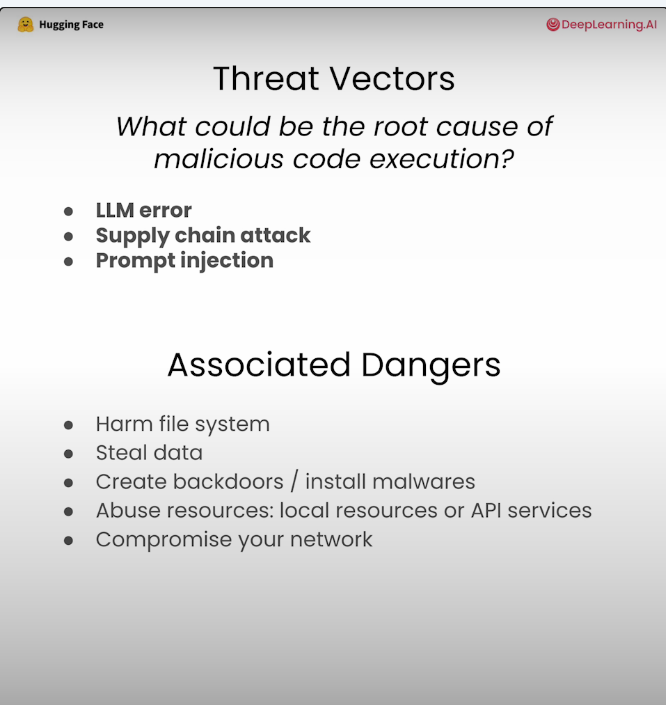

## Overview
- This directory goes over SmolAgents and how to use it to build Code agents. It has my notebooks & concepts based on https://learn.deeplearning.ai/courses/building-code-agents-with-hugging-face-smolagents/

## Why coding agents?
- Compared to standard json/text actions, Coding agents are more powerful:
- They have many advantages
    - Less number of tool calls => Reduce latency, cost, errors
    - Can assign variables & functions to use later
    - Build your own tools by defining functions

## How to perform Secure code execution?
- Highly autonomous but risky. Can erase disk. 
- Some solutions are:
    - Using built-in Python interpreter 
        - Can white list packages
        - Restricts some libraries, inifinite loops, etc.
        - Still not 100% safe
    - Using remote sandbox environment (not local env)
        - Use sandbox only for tool calls
            - Will not work for multi-agent system, which needs access to all API keys, etc.
        - Use sandbox to execute entire workflow
            - Transfer API keys, etc. to sandbox.
            - Can use Docker or E2B 

# Images
- Agency Levels & Agents History
    -    
    -  
- Standard JSON/text based Loop (vs) Code Agents
    -  
    -  
    -  
- Secure Code Execution
    -  
    -  
    -  
    -  

## References
1. https://learn.deeplearning.ai/courses/building-code-agents-with-hugging-face-smolagents/